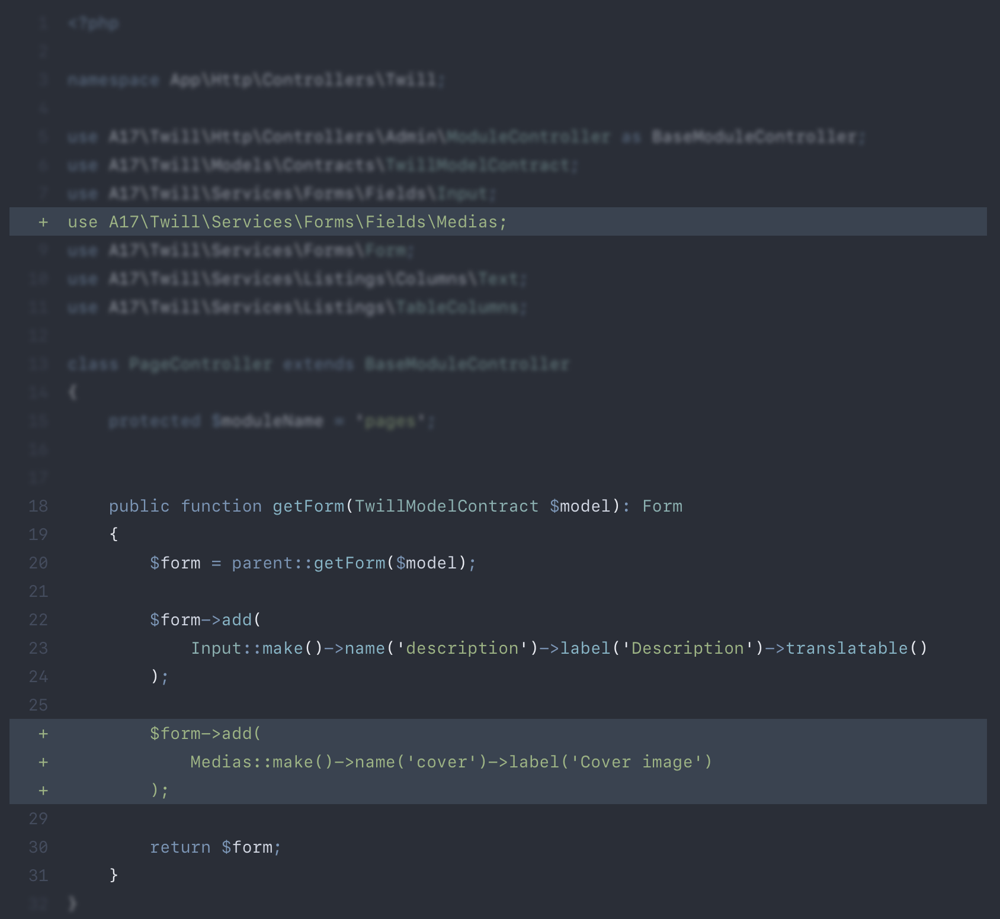

# PhpTorch

PhpTorch is a package for documentation purposes. It uses [nikic/php-parser](https://github.com/nikic/PHP-Parser)
to parse a php class, which can then be modified using highlighting actions.

The end result will be printed as code with [torchlight](https://torchlight.dev) annotations.

Example:

```php
$highlighter = \A17\PhpTorch\Highlight::new('PageController.php')
  ->focusMethods('getForm')
  ->diffImports(\A17\Twill\Services\Forms\Fields\Medias::class)
  ->focusImports(\A17\Twill\Services\Forms\Fields\Medias::class)
  ->diffInMethod('getForm', 7, 9);
```

Then you can provide the output to torchlight which will result in:



## Available methods

For now check [the highlighter class public methods](./src/Highlight.php) or consult the tests.

## Todo

- [ ] Add support for non class files.

## Examples

### Direct usage

```php
$highlighter = \A17\PhpTorch\Highlight::new('PageController.php')
  ->focusMethods('getForm')
  ->diffImports(\A17\Twill\Services\Forms\Fields\Medias::class)
  ->focusImports(\A17\Twill\Services\Forms\Fields\Medias::class)
  ->diffInMethod('getForm', 7, 9);
```

### Jigsaw / markdown

If you want to use this in Jigsaw, you should require `"torchlight/torchlight-jigsaw": "^0.3.4",` in addition to this
package.

Then you can start a code snippet with 3 backticks followed by phptorch like this:

```
\```phptorch
{ JSON }
##CODE##
<?php ...
\```
```

Linked file:

```phptorch
{
  "file": "../../examples/blog/app/Models/Blog.php",
  "collapseAll": "",
  "focusProperties": [
    "slugAttributes"
  ]
}

```

Inline code:

```phptorch
{
    "collapseAll": "",
    "focusProperties": [
        "slugAttributes"
    ],
    "diffMethods": [
      {
        "methods": "someMethod", 
        "addRemove": "remove"
      }
    ],
    "focusMethods": "someMethod"
}
##CODE##
<?php

class Example {
  public bool $slugAttributes = false;
 
  public function someMethod(): void {
  }
}

class Foo {

}
```
